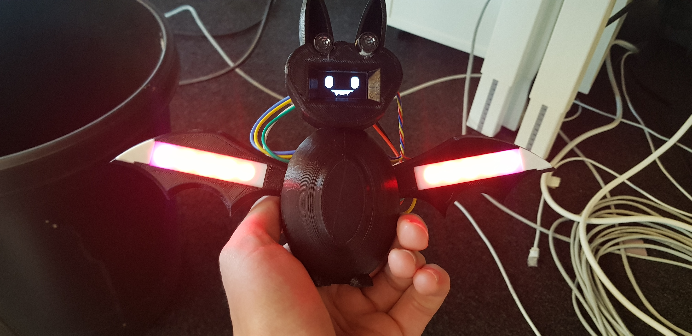
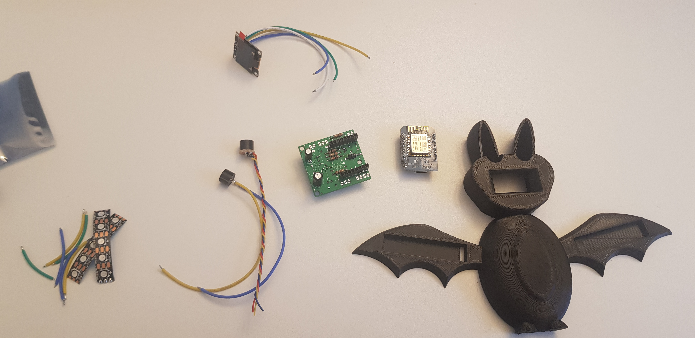
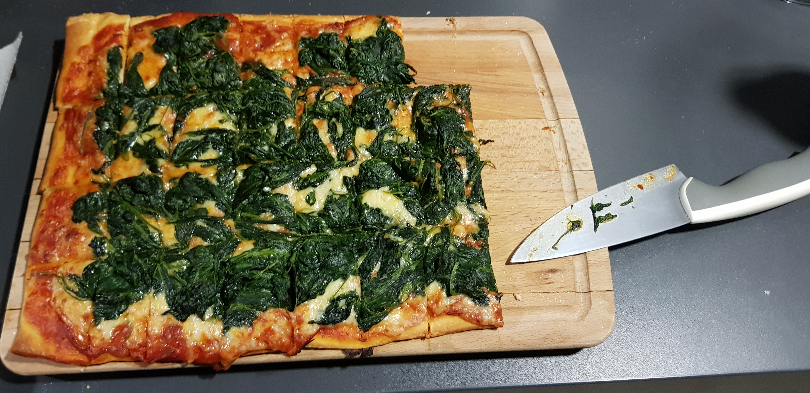
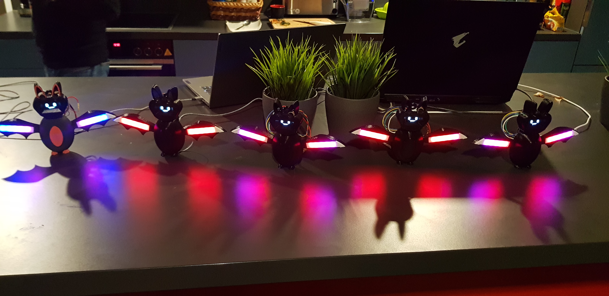
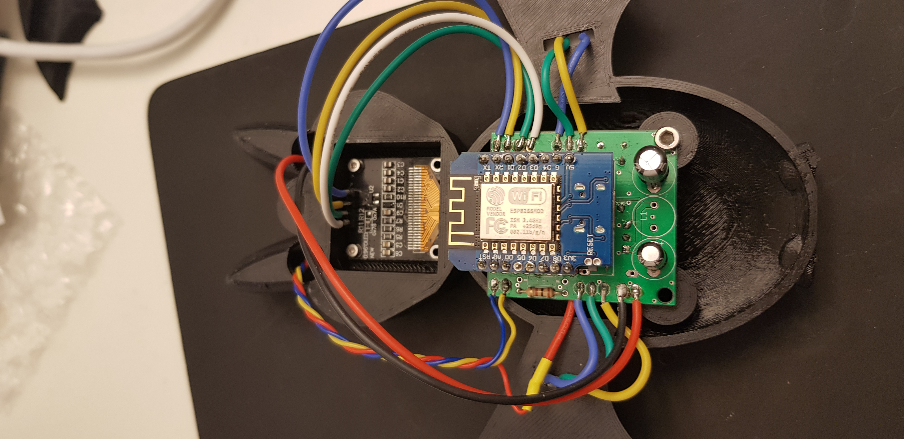

# holiday_project_2022

A group of friends got together around the holidays in 2022 to build a fun electronics project in 4 weeks. We decided to build a bat that had some RGB lights, some ultrasound sensors, and a oled for a face.  

This involved designing the bat model and 3d-printing it, working on a software package to drive all the electronics and figure out when something was in front of the bat, and desiging hardware and a PCB to make connecting the electronics easy. You can find more details on each of these in the subfolders design, hardware, and firmware.  

Here are all the parts:  

We had a pizza party and built 5 of them:

Heres what the back looks like assembled:

This is what the bat is seeing, ie the signal it is sampling and getting from its transducer which is listening:

