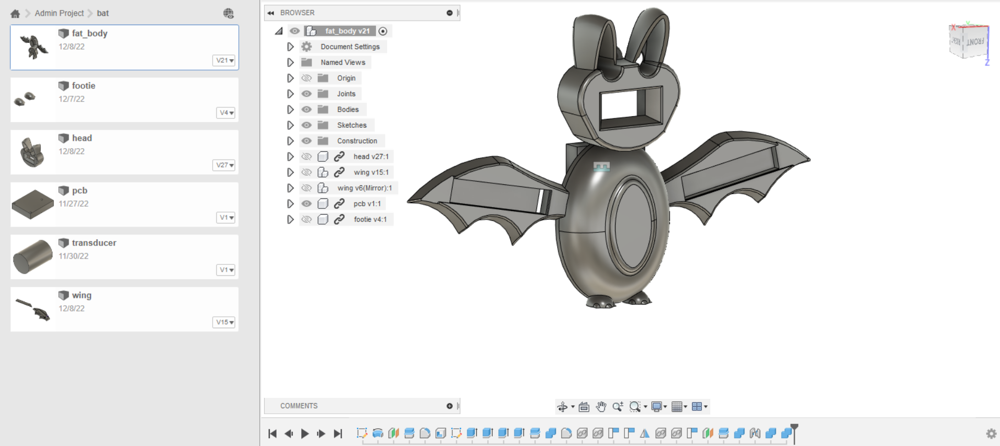

# Design

For the design of this project, we had to make a 3d Model that would fit all of our components. We wanted something cute too.

We did an initial drawing and some browing of inspiration and settled on a cartoonish theme.

From here, we started modelling components in Fusion 360. We did an iterative process, modelling each component like the wing and then printing it to get a feel for how big and how components would fit into it.

You can see the CAD files here, and heres an example screenshot of how they fit together:  
  

Also included is an STL file of the components joined together that is ready to print, and STL files for the sliders on each wing. We printed the body in Black PLA+ with tree supports, and we printed the sliders in White PLA without supports. We found white pla worked best to diffuse the LEDS in the wings.