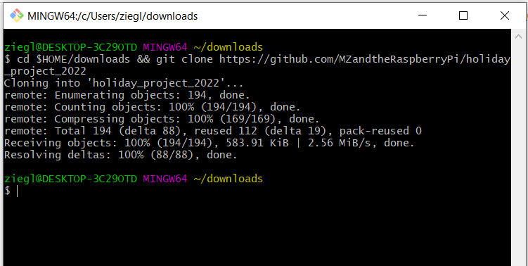
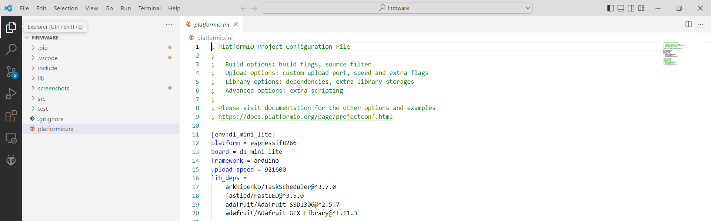
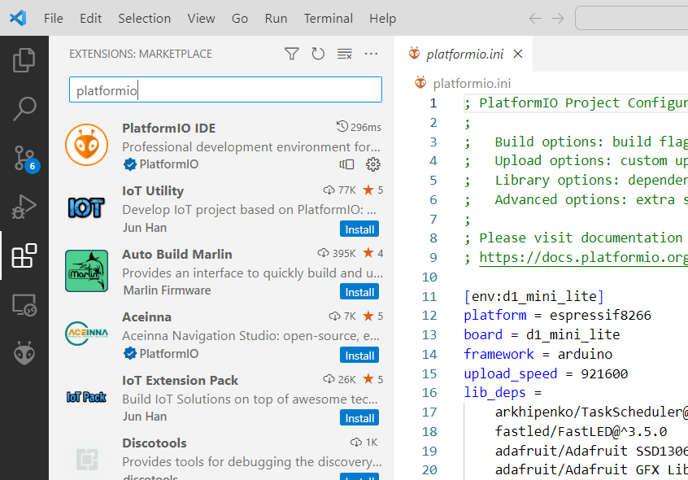
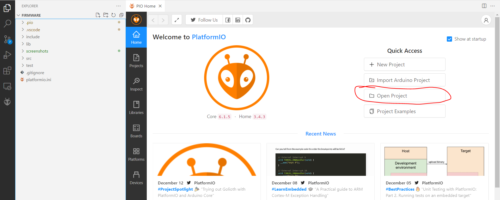
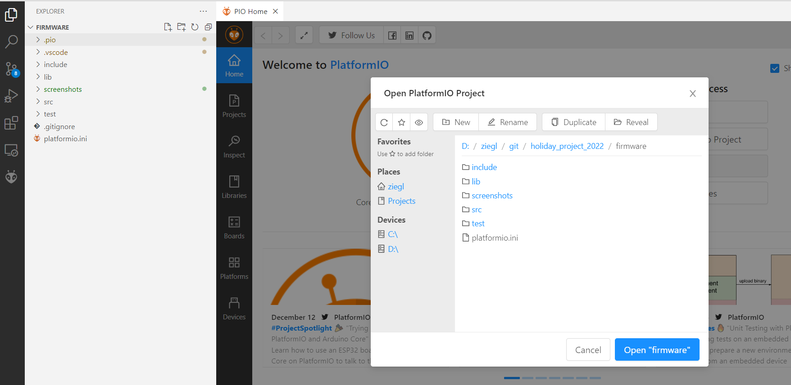
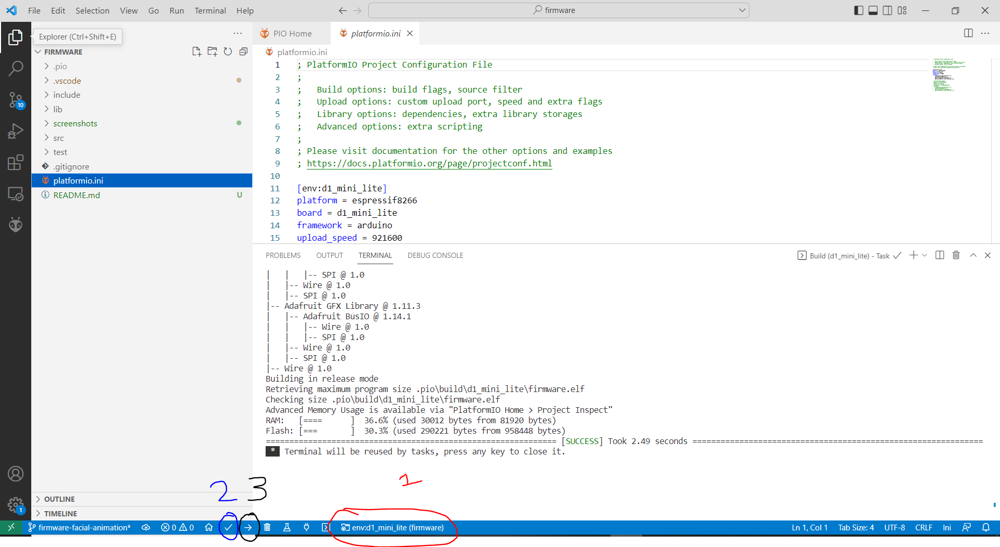

# Firmware

This project's codebase is written in C++. It uses Platform IO to structure, compile, and upload the project, which is similar to Arduino but with some more professional features.

## Uploading the Firmware
Lets say you have a blank ESP and want to upload the code for this project to it.

### Installing VS Code
First, install VS Code. For example, you can download it [here](https://code.visualstudio.com/download).

### Installing GIT
We will need GIT installed to download the code for our project. You can install it [here](https://git-scm.com/download/win) on windows.

### Cloning the Project
You will need to clone the project using git, which means you will copy the code to a place on your computer.

Open Git Bash, which you should have installed when you installed git, and you will see a terminal. Enter the below command into the terminal, and run it by hitting enter. It will clone the code to a new folder. It should look like the below when you are done:  
  

### Opening the Repo in VS Code
Open VS Code, and click the file menu in the top left and hit open. Browse to your downloads folder, where we saved the code we downloaded.  

From there, open the folder. You should see something like the below:  
  

### Installing Platform IO
Platform IO is an extension for VS Code. In the dark grey menu on the left, click the boxes, and search for platform io and install it.

  

### Opening the Project with Platform IO
From here, relaunch VS Code. When you do, platform IO may show you a menu like the below. Click open a project, and open the firmware folder in the repo we cloned:  

  
  

### Compile the code and Upload
Select in the bottom the ESP we have, and from there hit the green checkbox to compile. If that goes well, then hit the upload button, the arrow.  

  

