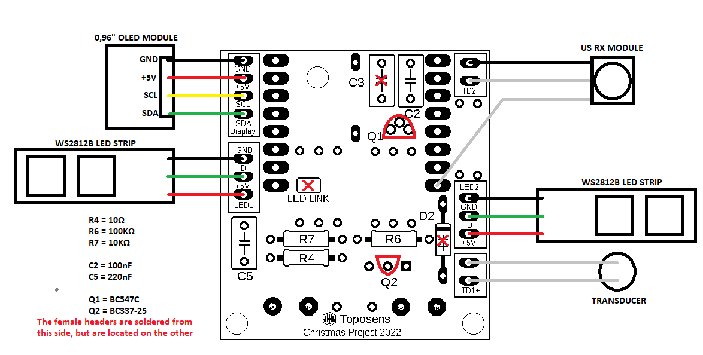
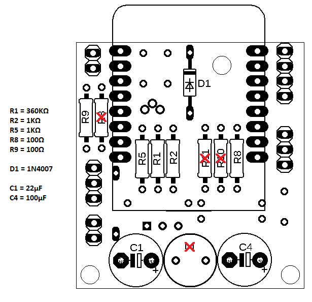

# Hardware

We first brainstormed what components we needed. We wanted to visualize the face, and were deciding between LED Matrix and a screen. We went for an OLED Screen to have better resolution for expressions and animations. We also wanted lights in the wings, and quickly decided on RGB Addressable LEDs. We also wanted ultrasound sensors, and decided eventually on a transducer and complementary circuit.  

From there, it made sense to make a custom PCB to bring it all together. We designed and got the order out quickly, to accomodate shipping times from China. We used only through-hole components to make it easier to solder. You can find a list of components in the BOM.xls file in the repo. If you wanted to order your own, you can find the CAM zipped file in the CAM folder, and can upload that to most fabrication sites.  

An assembly plan is included here. Some of the components were unnescessary, and so we crossed those off in red in the images:  
  

  
