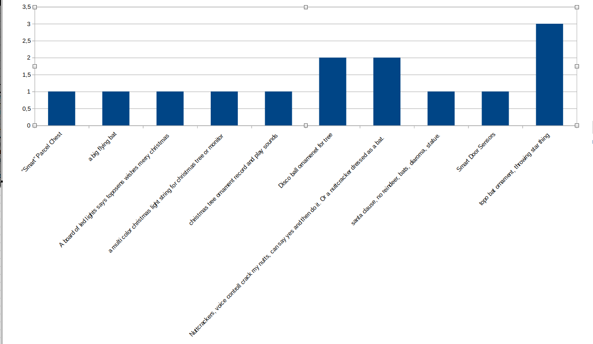

# Planning

This is a project that a group of friends are taking on towards the holidays in 2022. We thought it would be fun to build a project together involving electronics and a little coding.  

First, we need to decide on a project idea and requirements. We will try and keep it relatively small, quick, and cheap. Then we will plan out the hardware, software, and design. We will make a prototype and do a proof of concept. Then we will order components for everyone in the group and build it all together.

## First Meeting Agenda
* Introduce Project
* Timeline
* Sub-groups
* Brainstorming
* Technology brainstorming

## Timeline

## Voting Results
The bat ornament won, we will make that!

## Sub-groups
### Hardware
This group will plan out how to accomplish the requirements from a hardware perspective. This may include identifying components to use and making a schematic.
### Software
This group will plan out how to accomplish the requirements from a software perspective. How do we upload the code, what libraries will we use, how will we structure the code, and how can individuals customize it.
### Design
This group will plan out what the project will look like, and do any CAD nescessary. This may involve making a 3d model and printing it and ensuring fit.
### Prototypers
This group will take the work from the hardware, software, and design groups and make sure it all fits together, building an initial model of the project and ensuring any errors are corrected. This is a nescessary precursor to the group build.

## Final Build
This will involve everyone, we will all get together and everyone will put together and customize their own project.
